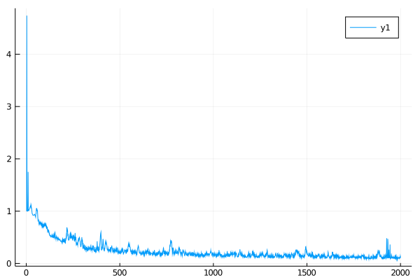
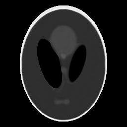
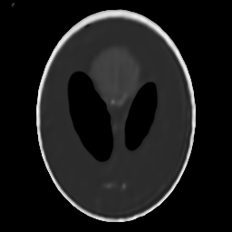

# Welcome to JuliaTomo/DeepImagePrior.jl

The code reconstructs a 2D image from tomographic measurements based on Deep Image Prior [1]. Gadelha et al. [2] apply DIP to the tomographic reconstruction task. This code implements [2] with some differences. We use a sparse array as a forward projection operator and use the automatic differentiation from Flux. This makes it possible to use more flexible geometry, whereas [2] only supports the limited geometry. For the forward operator, we need another package `TomoForward` (Check the installation below).

For the UNet architecture, I modify the code from [3]. Many thanks to the author of [3]! For the bilinear upsampling layer, I use the codes from the branch: https://github.com/FluxML/Flux.jl/pull/1180 . If it is merged, it will be removed.

## Install

Install [Julia](https://julialang.org/downloads/) and in [Julia REPL](https://docs.julialang.org/en/v1/stdlib/REPL/) type:

```
julia> ]
pkg> add CUDA, Flux, Zygote
pkg> add https://github.com/JuliaTomo/TomoForward.jl
pkg> add https://github.com/JuliaTomo/DeepImagePrior.jl
```

## Examples

Please see codes in `examples` folder.

## Todos

- Check the paper: M. Z. Darestani and R. Heckel, “Can Un-trained Neural Networks Compete with Trained Neural Networks at Image Reconstruction?,” arXiv:2007.02471 http://arxiv.org/abs/2007.02471.

## Demo

Loss per iteration


Reconstruction error per iteration



Best reconstruction result (from clean and noisy)

 

Final reconstruction result

## References

- [1] Ulyanov, D., Vedaldi, A., Lempitsky, V., 2018. Deep image prior, in: CVPR.
- [2] Gadelha, M., Wang, R., Maji, S., 2019. Shape Reconstruction Using Differentiable Projections and Deep Priors, in: ICCV. https://doi.org/10.1109/ICCV.2019.00011
- [3] https://github.com/chinglamchoi/julia_unet/